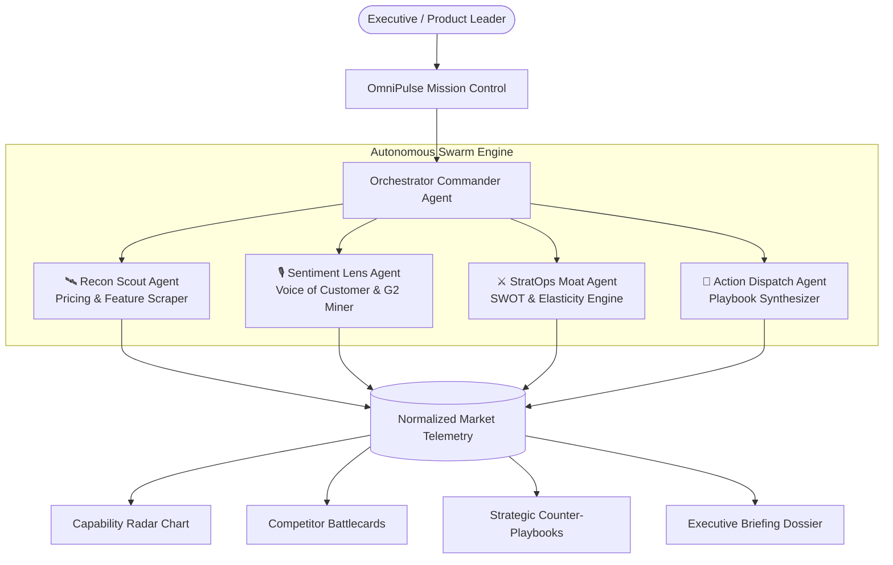

# 🛰️ OmniPulse AI

> **Autonomous Enterprise Market & Competitor Intelligence Platform powered by a Multi-Agent Swarm.**  
> *Targeting the **"Best SaaS Product"** Prize at AI Builders Hackathon 2026.*

[](LICENSE)
[](https://ai-builders-hackathon-2026.devpost.com/)
[](#technology-stack)
[](#features)

---

## 🌟 Overview

**OmniPulse AI** converts raw competitor web telemetry into actionable executive counter-playbooks. Instead of spending 20+ hours a week manually monitoring competitor changelogs, pricing adjustments, and G2 reviews, OmniPulse orchestrates a specialized **Multi-Agent Swarm** that works in parallel to deliver real-time market intelligence, threat indices, and revenue-maximizing playbooks.

---

## 🚀 Key Features

- 🛰️ **Autonomous Multi-Agent Mission Control:** Watch 4 specialist agents (*Recon Scout, Sentiment Lens, StratOps Moat, Action Dispatch*) execute parallel scans with live streaming reasoning logs and status telemetry.
- 📊 **Executive Analytics Dashboard:** Real-time Threat Indices, Pricing Advantage Deltas, Feature Parity Ratios, and Multi-Dimensional Capability Radar charts.
- 🏢 **In-Depth Competitor Battlecards:** Side-by-side breakdowns of competitor tiers, pricing models, growth velocities, moats, and exploitable vulnerabilities.
- 🎯 **Tactical Playbook Studio:** Synthesizes prioritized counter-strategies (*Pricing Counter-Attacks, Feature Leapfrogs, SEO Conquests*) with projected ARR impact and step-by-step sprint tasks.
- 🎙️ **Customer Sentiment & Voice Miner:** Unsupervised clustering of real customer reviews across G2, Reddit, and TrustPilot to highlight why users choose you and why they churn from competitors.
- 📑 **One-Click Executive Briefing Export:** Instant generation of clean Markdown and print-ready PDF executive dossiers for board meetings and strategy reviews.
- ⚡ **Multi-Sector Pre-Loaded Datasets:** Seamlessly switch between *AI Workspace & Productivity*, *Fintech & Payment Rails*, and *Cloud Databases & Serverless Backends*.

---

## 🏗️ Multi-Agent Architecture



---

## 📂 Project Structure

```
├── index.html                  # Main Single-Page Web Application Entry Point
├── LICENSE                     # MIT Open Source License
├── README.md                   # Project Documentation
├── src/
│   ├── css/
│   │   └── style.css           # Glassmorphism Design System & Cyber-Dark Aesthetics
│   └── js/
│       ├── app.js              # Application Controller & UI State Management
│       ├── agentEngine.js      # Multi-Agent Swarm Orchestrator & Live Logger
│       ├── charts.js           # Lightweight SVG & Canvas Radar & Gauge Engine
│       └── presetData.js       # Pre-configured Enterprise Sector Intelligence
└── docs/
    ├── presentation_deck.md    # 10-Slide Hackathon Presentation Deck
    ├── demo_video_script.md    # 3-Minute Demo Video Storyboard & Script
    └── devpost_submission.md   # Official Devpost Submission Text
```

---

## ⚡ Quick Start (Run Locally in Seconds)

OmniPulse AI is built using pure, high-performance web standards with **zero build steps or heavy dependencies required**.

### Option A: Python HTTP Server (Recommended)
```bash
# In the project root directory:
python -m http.server 8080
```
Then open `http://localhost:8080` in your web browser.

### Option B: Node.js / npx serve
```bash
npx serve .
```

### Option C: VS Code Live Server
Right-click `index.html` and select **"Open with Live Server"**.

---

## 🏆 Hackathon Deliverables

| Deliverable | Description | Link |
| :--- | :--- | :--- |
| **Working Software** | Functional Single Page SaaS Web Application | [index.html](index.html) |
| **Pitch Deck** | Complete 10-Slide Presentation Deck | [docs/presentation_deck.md](docs/presentation_deck.md) |
| **Demo Video Script** | 3-Minute Storyboard & Bilingual Voiceover Script | [docs/demo_video_script.md](docs/demo_video_script.md) |
| **Devpost Submission** | Formatted Devpost Submission Text | [docs/devpost_submission.md](docs/devpost_submission.md) |

---

## 📄 License

This project is licensed under the [MIT License](LICENSE).
